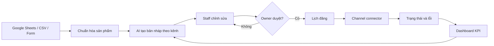

# OmniSmart - Kế hoạch từ đồ án thành sản phẩm

> Phiên bản: 2.0  
> Ngày lập: 14/08/2026  
> Mục tiêu gần: bản chạy thật cho vòng bán kết 17/09/2026  
> Mục tiêu sản phẩm: private beta có người dùng thật trước chung kết 02/10/2026

## 1. Quyết định sản phẩm

### Tuyên bố ngắn

**OmniSmart giúp cửa hàng nhỏ biến dữ liệu sản phẩm thành nội dung bán hàng đa kênh đã được kiểm duyệt, lên lịch và theo dõi trong một quy trình duy nhất.**

### Người dùng đầu tiên

- Chủ cửa hàng hoặc nhân viên marketing của cửa hàng nhỏ, có 1-5 người vận hành.
- Đang quản lý sản phẩm bằng Google Sheets/Excel và đăng nội dung thủ công.
- Đăng tối thiểu 10 nội dung/tuần trên Facebook, TikTok hoặc sàn thương mại điện tử.
- Có thể dành 30 phút/tuần để dùng thử và phản hồi.

### Bài toán cần chứng minh

Hiện người dùng phải sao chép thông tin sản phẩm, viết lại nội dung cho từng kênh, xin duyệt, đăng bài và theo dõi bằng nhiều công cụ rời rạc. Giả thuyết cần kiểm chứng:

- Thời gian từ sản phẩm đến bài đã duyệt giảm từ khoảng 20-30 phút xuống dưới 5 phút.
- Ít nhất 70% bản nháp AI được duyệt sau không quá một lần chỉnh sửa.
- Tỷ lệ đăng thành công đạt từ 95% với các kênh đã được cấp quyền.
- Một cửa hàng có thể hoàn thành onboarding và tạo bài đầu tiên trong dưới 10 phút.

Các con số ban đầu chỉ là **mục tiêu**, không được trình bày như kết quả cho tới khi đo trên người dùng thật.

## 2. Phạm vi MVP và những phần tạm hoãn

### MVP bắt buộc

1. Đăng nhập Google hoặc email, có phiên đăng nhập an toàn.
2. Một tài khoản có thể tạo cửa hàng và mời thành viên với vai trò Owner/Staff.
3. Nhập sản phẩm bằng biểu mẫu, CSV và đồng bộ Google Sheets.
4. AI sinh bản nháp riêng cho Facebook, TikTok và mô tả sàn từ cùng dữ liệu sản phẩm.
5. Trình soạn thảo có preview, lịch sử phiên bản và trạng thái Draft → Review → Approved.
6. Owner phải duyệt trước khi đăng; AI không tự xuất bản nội dung chưa duyệt.
7. Đăng ngay/lên lịch qua connector thật khi API cho phép; luôn có phương án xuất bản nháp/copy thủ công.
8. Theo dõi trạng thái job, retry có giới hạn, nhật ký lỗi và dashboard hiệu quả.
9. Audit log cho các thao tác quan trọng; xóa dữ liệu cửa hàng và thu hồi kết nối kênh.
10. Bản staging và production chạy bằng Docker, có HTTPS, backup và giám sát lỗi.

### Cắt khỏi MVP

- Không làm Edge-TTS và FFmpeg trong giai đoạn trước bán kết.
- Không kết nối đồng thời Shopee, TikTok và Meta bằng API thật nếu chưa được duyệt quyền.
- Không dùng RabbitMQ, Redis, microservice hoặc Kubernetes trong MVP.
- Không làm WebSocket, mobile app, chatbot bán hàng, thanh toán hoặc gói thuê bao trước khi có người dùng beta.
- Không xây hệ thống Admin lớn; chỉ cần màn hình hỗ trợ tối thiểu và audit log.

Lý do: file HTML dành 45/100 điểm cho tính thực tiễn và quy trình, 20 điểm cho độ hoàn thiện, chỉ 15 điểm cho AI. Một luồng chạy trọn vẹn có người dùng thật có giá trị hơn nhiều tính năng dở dang.

## 3. Luồng sản phẩm chạy thật



### Happy path để demo trong 10 phút

1. Đăng nhập bằng tài khoản thử nghiệm.
2. Đồng bộ một dòng sản phẩm từ Google Sheets.
3. Chọn giọng thương hiệu và ba kênh đầu ra.
4. AI tạo nội dung có cấu trúc; hiển thị chi phí, thời gian xử lý và cảnh báo an toàn.
5. Staff sửa một câu, gửi duyệt; Owner duyệt.
6. Chọn đăng ngay hoặc lên lịch.
7. Connector thật đăng nội dung hoặc tạo bản nháp hợp lệ; dashboard cập nhật trạng thái.
8. So sánh thời gian thao tác cũ và mới bằng số liệu đã đo.

### Luồng lỗi bắt buộc phải demo được

- AI timeout/rate limit: exponential backoff, tối đa 3 lần, sau đó cho phép thử lại thủ công.
- Token kênh hết hạn: chuyển job sang `ACTION_REQUIRED`, không mất nội dung.
- Nội dung bị chặn an toàn: giải thích lý do, cho sửa prompt/dữ liệu, không tự bỏ bộ lọc.
- Job bị gửi lặp: idempotency key ngăn đăng trùng.
- Connector chưa được duyệt production: chuyển sang “Xuất bản nháp/copy”, không giả mạo đăng thành công.

## 4. Tích hợp thực tế

### Thứ tự ưu tiên

1. **Google Sheets** - connector đầu vào production đầu tiên. API chính thức hỗ trợ đọc và ghi dữ liệu bảng tính; đây là cách thay file Excel rời rạc bằng kết nối mở nhưng vẫn đúng thói quen cửa hàng.
2. **Facebook Page** - connector xuất bản ưu tiên nếu đội đã có app, quyền và tài khoản thử nghiệm phù hợp.
3. **TikTok** - hỗ trợ upload draft trước; chỉ bật direct post công khai sau khi app được duyệt.
4. **Shopee** - để sau MVP nếu chưa có quyền đối tác/API hợp lệ; MVP dùng mẫu nội dung + nút copy/export.

TikTok yêu cầu app đăng ký, quyền `video.publish`, người dùng cấp quyền và audit; nội dung từ client chưa audit bị giới hạn ở chế độ riêng tư. Vì vậy không đưa “TikTok public direct post” vào tiêu chí hoàn thành bán kết nếu chưa có phê duyệt. Xem [TikTok Content Posting API](https://developers.tiktok.com/doc/content-posting-api-get-started/) và [quy trình đăng ký app](https://developers.tiktok.com/doc/getting-started-create-an-app).

Google Sheets API là REST API có thể đọc/ghi dữ liệu ô và quản lý spreadsheet. Xem [Google Sheets API Overview](https://developers.google.com/workspace/sheets/api/guides/concepts).

### Hợp đồng connector chung

Mỗi connector triển khai cùng một interface:

```text
connect(account)
validateConnection()
publish(content, idempotencyKey)
getStatus(externalId)
refreshCredential()
disconnect()
```

Nhờ vậy hệ thống có thể thay mock bằng API thật hoặc thêm kênh mới mà không sửa workflow lõi.

## 5. Kiến trúc kỹ thuật tối giản cho production

### Stack chốt

| Lớp | Công nghệ | Quyết định |
|---|---|---|
| Frontend | React + TypeScript + Vite + TailwindCSS | SPA responsive, ưu tiên desktop/tablet |
| Backend | Java 21 + Spring Boot 4.1.x | Modular monolith, REST API, OpenAPI |
| Auth | Spring Security + Google OAuth2/email | Session hoặc refresh token trong HttpOnly cookie; không lưu token nhạy cảm trong localStorage |
| Database | PostgreSQL | Nguồn dữ liệu chuẩn, migration bằng Flyway |
| Background jobs | PostgreSQL job table + Spring scheduler | Có lock, retry, idempotency; chưa cần RabbitMQ |
| Media | S3-compatible object storage | Upload qua signed URL, giới hạn loại và dung lượng file |
| AI | Gemini API qua adapter riêng | Structured output, prompt versioning, timeout, quota và cost log |
| Deploy | Docker + reverse proxy HTTPS | Tách staging/production, cấu hình qua secret manager/env |
| Observability | Structured logs + error tracking + health checks | Correlation ID cho từng request/job |
| CI/CD | GitHub Actions hoặc nền tảng tương đương | lint, test, build image, migrate, deploy, smoke test |

Spring Boot 4.1.x hỗ trợ Java 17 đến Java 26; dự án chọn Java 21 LTS để cân bằng độ ổn định và vòng đời hỗ trợ. Xem [Spring Boot system requirements](https://docs.spring.io/spring-boot/system-requirements.html).

### Vì sao bỏ RabbitMQ và Redis ở MVP

- PostgreSQL đã có mặt và đủ cho tải private beta.
- Giảm hai dịch vụ phải vận hành, backup, giám sát và debug.
- Job table vẫn thể hiện rõ tự động hóa, retry, trạng thái và idempotency.
- Chỉ thêm RabbitMQ khi số job lớn, cần nhiều loại worker độc lập hoặc database queue trở thành nút thắt.
- Chỉ thêm Redis khi có số liệu chứng minh cache/rate limiting phân tán là cần thiết.

### Module backend

```text
identity      tenant/store      catalog
content-ai    approval          publishing
connectors    analytics         audit
```

Giữ ranh giới module rõ, nhưng build và deploy một backend duy nhất. Connector và AI provider dùng adapter để thay thế độc lập.

### Mô hình dữ liệu tối thiểu

| Nhóm | Bảng |
|---|---|
| Identity | `users`, `stores`, `store_members`, `sessions` |
| Catalog | `products`, `product_media`, `imports` |
| Content | `content_items`, `content_versions`, `prompt_versions`, `approvals` |
| Integration | `connected_accounts`, `publishing_jobs`, `publishing_attempts` |
| Operation | `usage_events`, `audit_logs` |

Mọi bảng nghiệp vụ có `store_id`; mọi truy vấn phải kiểm tra tenant. Credential bên thứ ba được mã hóa khi lưu và không xuất hiện trong log.

## 6. Thiết kế AI có trách nhiệm

- AI chỉ tạo gợi ý; Owner chịu trách nhiệm duyệt nội dung trước khi xuất bản.
- Prompt được version hóa; lưu model, input hash, output, latency, token/cost và người duyệt.
- Dùng structured output/schema để giảm lỗi parse.
- Không gửi dữ liệu cá nhân hoặc bí mật kinh doanh không cần thiết vào model.
- Có bộ 30-50 sản phẩm mẫu để đánh giá độ đúng, giọng thương hiệu, vi phạm chính sách và hallucination.
- Không cho AI tự bịa giá, tồn kho, khuyến mãi hoặc cam kết sản phẩm; các trường này chỉ lấy từ dữ liệu có cấu trúc.
- Có rate limit theo store, timeout và retry với jitter; không giả định free tier luôn đủ tải.
- Hiển thị nhãn “Nội dung do AI hỗ trợ” trong màn hình duyệt và lưu dấu vết chỉnh sửa.

Gemini áp dụng quota theo RPM, TPM và RPD ở cấp project, có thể trả lỗi 429 khi vượt bất kỳ giới hạn nào; giới hạn còn phụ thuộc model/tier. Xem [Gemini API rate limits](https://ai.google.dev/gemini-api/docs/rate-limits). Bộ lọc an toàn cần được kiểm thử theo use case và kết quả chặn phải được xử lý rõ ràng; xem [Gemini safety settings](https://ai.google.dev/gemini-api/docs/safety-settings).

## 7. UX cần xây

### Sitemap MVP

```text
/login
/onboarding
/dashboard
/products
/products/:id
/content/new
/content/:id/edit
/approvals
/calendar
/publishing
/settings/store
/settings/members
/settings/integrations
```

### Nguyên tắc giao diện

- Một CTA chính trên mỗi màn hình.
- Trạng thái workflow có tên và màu nhất quán.
- Không hiển thị “thành công” trước khi nhận xác nhận từ connector.
- Preview theo kênh nằm cạnh editor; cảnh báo lỗi trước nút duyệt.
- Mọi tác vụ nền có progress, thời điểm cập nhật và nút retry.
- Có empty state với dữ liệu mẫu để demo không bị màn hình trống.
- Responsive từ 768px; keyboard focus, label form và contrast đạt mức sử dụng được.

### Trạng thái chuẩn

```text
DRAFT → IN_REVIEW → APPROVED → SCHEDULED → PUBLISHING → PUBLISHED
             ↘ REJECTED                    ↘ FAILED / ACTION_REQUIRED
```

## 8. Kế hoạch thực thi theo lịch cuộc thi

Kế hoạch 16 tuần cũ không còn phù hợp vì tại ngày 14/08 chỉ còn gần 5 tuần tới bán kết. Kế hoạch mới dùng lát cắt dọc: mỗi sprint phải tạo ra một phần luồng end-to-end chạy được.

### Sprint 0 - 14/08 đến 16/08: xác thực bài toán và khóa scope

- Phỏng vấn ít nhất 2 cửa hàng; chọn 1 design partner chính.
- Ghi lại quy trình hiện tại, thời gian từng bước và 10 sản phẩm mẫu được phép dùng.
- Chốt user journey, wireframe và tiêu chí chấp nhận.
- Tạo backlog P0/P1/P2; mọi việc ngoài MVP chuyển sang P2.

**Gate:** có người dùng cụ thể, dữ liệu được phép sử dụng và baseline trước khi code tính năng AI.

### Sprint 1 - 17/08 đến 23/08: xương sống sản phẩm

- Khởi tạo monorepo `frontend/`, `backend/`, `infra/`, `docs/`.
- CI, Docker Compose local, PostgreSQL, Flyway và seed demo.
- Auth, store, membership/RBAC, product CRUD, upload ảnh.
- Frontend login, onboarding, danh sách và chi tiết sản phẩm.
- Test tenant isolation và smoke test.

**Gate:** người dùng mới đăng nhập, tạo store và sản phẩm trên staging mà không cần sửa DB tay.

### Sprint 2 - 24/08 đến 30/08: AI và vòng duyệt

- Import CSV và Google Sheets connector thật.
- AI adapter, prompt version, structured output và usage log.
- Tạo ba bản nháp kênh; editor, preview, version history.
- Workflow Staff gửi duyệt, Owner approve/reject.
- Bộ eval 30-50 case; ghi tỷ lệ đạt và lỗi phổ biến.

**Gate:** từ một dòng Sheets đến nội dung được duyệt chạy end-to-end; không có trường giá/tồn kho bị AI bịa.

### Sprint 3 - 31/08 đến 06/09: publisher đáng tin cậy

- Job table, scheduler, locking, retry, idempotency và audit log.
- Một connector xuất bản thật; connector còn lại dùng draft/export trung thực.
- Calendar, publish now/schedule và màn hình lỗi.
- Kiểm thử token hết hạn, timeout, retry và job trùng.

**Gate:** 20 lần chạy liên tiếp không đăng trùng; trạng thái hiển thị đúng cả happy path và lỗi.

### Sprint 4 - 07/09 đến 13/09: private beta và production hardening

- Design partner dùng staging/production với dữ liệu đã đồng ý.
- Dashboard: thời gian tiết kiệm, số nội dung, tỷ lệ duyệt, tỷ lệ đăng thành công, AI cost/job.
- HTTPS, secrets, backup/restore rehearsal, rate limit, file validation và dependency scan.
- Logging, health check, alert lỗi; runbook xử lý sự cố.
- Sửa 5 vấn đề UX lớn nhất từ phiên dùng thật.

**Gate:** design partner tự hoàn thành luồng chính; restore backup được kiểm chứng; không còn lỗi P0/P1.

### Release Candidate - 14/09 đến 17/09: bán kết

- Feature freeze từ 14/09; chỉ sửa lỗi ảnh hưởng demo/dữ liệu/bảo mật.
- Chuẩn bị video dưới 5 phút, slide, tài khoản demo và dữ liệu dự phòng.
- Rehearse demo online 5 lần; có video fallback và script khôi phục.
- Nộp source/config, README, sơ đồ, tài liệu dữ liệu và giấy phép thư viện.

**Mốc:** bán kết 19:00 ngày 17/09/2026.

### Product Beta - 18/09 đến 27/09

- Tổng hợp phản hồi giám khảo và người dùng; chỉ chọn tối đa 3 cải tiến có tác động lớn.
- Hoàn thiện onboarding, quyền riêng tư, xóa tài khoản/dữ liệu, support email.
- Mời 3-5 cửa hàng dùng beta; theo dõi activation và D7 retention.
- Thử nghiệm giá: pilot miễn phí có giới hạn; phỏng vấn willingness-to-pay trước khi code billing.

**Gate:** ít nhất 3 cửa hàng onboard, 2 cửa hàng quay lại tuần kế tiếp, có số liệu thật để trình bày.

### Chung kết - 28/09 đến 02/10

- Feature freeze; tối ưu độ ổn định và câu chuyện before/after.
- Hoàn thiện báo cáo, architecture decision records, privacy notice và demo 10 phút.
- Chuẩn bị trả lời về quyền API, chi phí AI, bảo mật tenant, backup và roadmap scale.

**Mốc:** chung kết 12:30 ngày 02/10/2026.

## 9. Backlog theo ưu tiên

### P0 - thiếu là không phải product

- Auth, tenant isolation, RBAC.
- Product import/form, AI draft, editor, approval.
- Scheduler, ít nhất một connector thật hoặc draft API hợp lệ.
- Idempotency, retry, audit, error state.
- Staging/production, HTTPS, backup/restore, logs/alerts.
- Privacy notice, consent dữ liệu, delete/export dữ liệu.
- Test và tài liệu vận hành.

### P1 - làm sau khi P0 ổn định

- Brand voice template và content template tự cấu hình.
- Calendar kéo-thả, bulk generation có giới hạn.
- Analytics theo kênh khi API cung cấp.
- Mời thành viên, email notification.
- Usage limit và màn hình quản trị quota.

### P2 - sau chung kết

- Video/TTS pipeline.
- RabbitMQ/Redis khi số liệu tải yêu cầu.
- Nhiều tenant trả phí, billing, invoice.
- Mobile app, social inbox, CRM/sales pipeline.
- AI agent tự lập campaign; vẫn cần human approval ở bước rủi ro cao.

## 10. Definition of Done

Một story chỉ hoàn thành khi:

- Có acceptance criteria đã chạy qua.
- Happy path và ít nhất một error path có test.
- Không lộ secret/token/PII trong log hoặc response.
- Có loading, empty, success và error state trên UI.
- Có audit event nếu thay đổi dữ liệu quan trọng.
- OpenAPI/README được cập nhật.
- Chạy được trên staging qua pipeline, không cần thao tác DB tay.

### Ngưỡng release production beta

- Không còn lỗi P0/P1 đã biết.
- Unit/integration test cho auth, tenant, approval, publish và idempotency.
- 20 kịch bản end-to-end cốt lõi đạt 100% trước release.
- p95 API không gọi AI dưới 500 ms ở tải beta; tác vụ AI chạy nền và có timeout.
- Tỷ lệ job thành công từ 95% hoặc lỗi hiển thị đúng và retry được.
- Backup hằng ngày; đã thử restore ít nhất một lần.
- Có rollback image/database migration an toàn.
- Uptime/health alert và người chịu trách nhiệm phản hồi sự cố.

## 11. KPI sản phẩm

### North-star metric

**Số nội dung đã được duyệt và xuất bản thành công mỗi tuần trên mỗi cửa hàng active.**

### Funnel cần đo

| Bước | KPI ban đầu |
|---|---|
| Signup → tạo store | ≥ 80% |
| Tạo store → import sản phẩm | ≥ 70% |
| Import → tạo draft AI | ≥ 70% |
| Draft → approved | ≥ 60% |
| Approved → published/exported | ≥ 80% |
| Quay lại trong 7 ngày | ≥ 40% ở private beta |

### Chất lượng và kinh tế

- Thời gian trung vị từ product đến approved content.
- Tỷ lệ draft được duyệt với 0-1 lần sửa.
- Tỷ lệ publish success, retry và đăng trùng.
- Token/cost cho một draft và một nội dung published.
- Số phút tiết kiệm do người dùng tự xác nhận.
- Số ticket/lỗi trên mỗi 100 job.

## 12. Bám thang điểm 100 của file HTML

| Tiêu chí | Điểm | Bằng chứng phải chuẩn bị |
|---|---:|---|
| Thực tiễn và giá trị | 25 | Design partner thật, consent, video dùng thử, baseline và số phút tiết kiệm |
| Hoàn thiện và UX | 20 | Onboarding dưới 10 phút, luồng chính tự dùng được, error state, staging/production |
| Quy trình và tích hợp | 20 | Sơ đồ end-to-end, Sheets API thật, connector thật/draft hợp lệ, retry + idempotency |
| AI phù hợp và an toàn | 15 | Eval set, human approval, safety handling, không bịa dữ liệu cấu trúc, usage/cost log |
| Sáng tạo và mở rộng | 10 | Connector adapter, modular monolith, roadmap dựa trên số liệu thay vì hạ tầng trình diễn |
| Hồ sơ và trình bày | 10 | Source/config, README, runbook, sơ đồ, video dưới 5 phút, tài khoản và dữ liệu demo |

### Hồ sơ bắt buộc

- Mã nguồn/tệp cấu hình và hướng dẫn cài đặt, vận hành.
- Tài liệu bài toán, người dùng, kiến trúc, workflow, AI, input/output.
- Video demo không quá 5 phút, slide và tài khoản thử nghiệm.
- Cam kết dữ liệu, danh sách mã nguồn mở và dịch vụ bên thứ ba.

## 13. Bảo mật, pháp lý và vận hành

### Trước private beta

- HTTPS toàn bộ; cookie `HttpOnly`, `Secure`, `SameSite` phù hợp.
- RBAC và kiểm tra `store_id` ở service/repository; test truy cập chéo tenant.
- Mã hóa credential connector; key không nằm trong source hoặc image.
- Validation MIME/size, signed upload URL, quét file nếu nhận tệp từ người dùng.
- Rate limit auth/AI/publish; CSRF/CORS cấu hình theo domain production.
- Audit login, membership, approval, publish, credential change và delete.
- Privacy notice, terms tối thiểu, quy trình thu hồi quyền/xóa dữ liệu.
- Dữ liệu demo tách khỏi production và không chứa PII thật nếu chưa có phép.

### Runbook tối thiểu

- AI provider lỗi hoặc quota hết.
- Database đầy/chậm và migration thất bại.
- Connector token hết hạn hoặc bị thu hồi.
- Job mắc kẹt/đăng trùng.
- Rollback release.
- Restore backup.
- Lộ credential: rotate, revoke, audit phạm vi ảnh hưởng và thông báo.

## 14. Chiến lược deploy

### Môi trường

| Môi trường | Dữ liệu | Mục đích |
|---|---|---|
| Local | seed giả lập | phát triển và test |
| Staging | dữ liệu mẫu được phép | QA, demo rehearsal, test migration |
| Production | dữ liệu beta tối thiểu | người dùng thật |

### Pipeline

```text
Pull request
→ lint + unit test + integration test
→ build frontend/backend images
→ dependency/security scan
→ deploy staging
→ migrate + smoke test
→ manual approval
→ deploy production
→ smoke test + monitor
```

### Topology beta

- Frontend static qua CDN hoặc reverse proxy.
- 1-2 backend container stateless.
- PostgreSQL managed hoặc VM riêng có backup ngoài máy.
- S3-compatible object storage.
- Reverse proxy quản lý TLS.
- Domain riêng: `app`, `api`, `staging`.

Không đặt database production trong cùng một container lifecycle với app. Nếu dùng một VPS vì ngân sách, backup phải được đẩy sang nơi lưu trữ khác và phải có restore rehearsal.

## 15. Quản trị mã nguồn trên GitHub

GitHub là một phần của bằng chứng về độ hoàn thiện sản phẩm: giám khảo cần nhìn thấy lịch sử phát triển, cách đội kiểm soát chất lượng, khả năng tái tạo bản release và giấy phép sử dụng rõ ràng. Không đánh giá chất lượng repository chỉ bằng số lượng commit.

### Quyết định repository

- Tạo một GitHub Organization của đội và một repository `omnismart`.
- Giữ repository **public** theo yêu cầu cuộc thi open-source và không đưa secret, PII hoặc tài liệu chưa rõ quyền phân phối vào lịch sử Git.
- Mời thành viên bằng tài khoản cá nhân; không dùng chung tài khoản hoặc Personal Access Token.
- Bật MFA cho toàn bộ thành viên và chỉ cấp quyền Admin cho tối đa hai người.
- Tuyệt đối không commit `.env`, API key, OAuth secret, database dump hoặc dữ liệu người dùng.
- Dùng Apache-2.0 cho mã nguồn do đội tạo; mọi dependency và asset vẫn phải qua License Gate bên dưới.

### Cấu trúc repository phải có

```text
omnismart/
├── .github/
│   ├── workflows/
│   │   ├── ci.yml
│   │   ├── security.yml
│   │   └── release.yml
│   ├── ISSUE_TEMPLATE/
│   ├── pull_request_template.md
│   ├── CODEOWNERS
│   └── dependabot.yml
├── backend/
├── frontend/
├── infra/
├── docs/
│   ├── architecture/
│   ├── adr/
│   ├── demo/
│   └── operations/
├── .editorconfig
├── .env.example
├── .gitignore
├── CHANGELOG.md
├── CONTRIBUTING.md
├── LICENSE
├── README.md
├── SECURITY.md
└── THIRD_PARTY_NOTICES.md
```

`README.md` phải trả lời được: sản phẩm giải quyết gì, ai dùng, kiến trúc, cách chạy local, cấu hình cần thiết, tài khoản demo, test, deploy và giới hạn API. `.env.example` chỉ chứa tên biến cùng giá trị giả an toàn.

### Branch, issue và pull request workflow

- Dùng trunk-based development: `main` luôn có thể deploy; branch ngắn dạng `feat/123-ai-draft`, `fix/145-publish-retry`, `docs/32-runbook`.
- Mọi thay đổi đi qua Issue có acceptance criteria và Pull Request; không push trực tiếp vào `main`.
- Commit theo Conventional Commits: `feat:`, `fix:`, `docs:`, `test:`, `build:`, `ci:`, `chore:`.
- PR nhỏ, ưu tiên dưới 400 dòng thay đổi; tách refactor khỏi feature nếu có thể.
- PR template bắt buộc có: vấn đề, giải pháp, cách test, ảnh/video UI, migration, rủi ro, rollback, security/privacy impact.
- Tối thiểu một người khác review; thay đổi auth, tenant, credential, migration và deploy cần CODEOWNER tương ứng duyệt.
- Squash merge để mỗi PR tạo một commit có ý nghĩa trên `main`; xóa branch sau merge.
- Không dùng số lượng commit làm KPI; dùng lead time, tỷ lệ PR qua CI lần đầu, defect sau merge và khả năng truy vết Issue → PR → Release.

### Ruleset cho `main`

- Bắt buộc Pull Request trước khi merge.
- Bắt buộc ít nhất 1 approval và giải quyết toàn bộ review conversation.
- Bắt buộc status checks: `frontend`, `backend`, `integration`, `security`, `docs`.
- Branch phải cập nhật với `main` trước khi merge nếu thay đổi có xung đột/rủi ro cao.
- Chặn force-push và delete branch mặc định.
- Bật secret scanning/push protection và Dependabot alerts nếu gói GitHub của repo hỗ trợ.
- Không cho workflow từ PR không tin cậy truy cập production secrets.

### GitHub Actions workflow

GitHub chỉ nhận workflow trong `.github/workflows` và có thể chạy build/test khi push hoặc deploy sau khi PR được merge. Xem [GitHub Actions Quickstart](https://docs.github.com/en/actions/get-started/quickstart).

| Workflow | Trigger | Công việc bắt buộc |
|---|---|---|
| `ci.yml` | PR và push `main` | format/lint, frontend test/build, backend unit/integration test, migration validation, Docker build |
| `security.yml` | PR, push và lịch hằng tuần | dependency review, secret scan, SAST, kiểm tra image/dependency có lỗ hổng nghiêm trọng |
| `release.yml` | tag `v*` hoặc manual approval | build image bất biến, tạo SBOM, đẩy registry, deploy staging, smoke test, phê duyệt production |

Quy tắc workflow:

- Pin action bên thứ ba theo full commit SHA; Dependabot cập nhật GitHub Actions hằng tuần.
- Chỉ cấp `permissions` tối thiểu cho từng job; mặc định `contents: read`.
- Dùng OIDC hoặc environment secrets để deploy, không lưu cloud key dài hạn trong YAML.
- Bật `concurrency` để một nhánh/môi trường không có hai deployment cạnh tranh.
- Production dùng GitHub Environment có required reviewer; không auto-deploy trực tiếp từ PR.
- Artifact release phải gắn với commit SHA và image digest để rollback chính xác.

Dependabot được cấu hình bằng `.github/dependabot.yml` và có thể theo dõi npm, Maven/Gradle, Docker và GitHub Actions. Xem [GitHub Dependabot version updates](https://docs.github.com/en/code-security/how-tos/secure-your-supply-chain/secure-your-dependencies/configure-version-updates).

### Release và truy vết

- Semantic Versioning: `v0.x.y` trong beta; chỉ lên `v1.0.0` khi đạt release gate sản phẩm.
- Mỗi release có tag, GitHub Release, changelog, migration note, known issues và hướng dẫn rollback.
- Tạo các mốc tối thiểu: `v0.1.0` xương sống, `v0.2.0` AI/approval, `v0.3.0` publisher, `v0.4.0-rc.1` bán kết, `v0.5.0-beta.1` private beta.
- Không sửa artifact sau release; bản sửa phải có version mới.
- Lưu demo script, slide source và kiến trúc tương ứng với tag dùng để thi.

### License Gate - phải hoàn thành trước khi đưa thành phần mới vào repository

Có hai quyết định độc lập:

1. **License của OmniSmart:** quyết định người khác có được dùng, sửa, phân phối hoặc thương mại hóa mã nguồn của đội hay không.
2. **License của dependency:** đội phải kê khai và tuân thủ license của từng thư viện, font, icon, model, dataset và dịch vụ bên thứ ba.

| Phương án | Khi dùng | Hệ quả |
|---|---|---|
| Proprietary / All rights reserved | Muốn giữ sản phẩm đóng và thương mại hóa | Repo private; người khác không có quyền sao chép ngoài quyền được cấp rõ ràng |
| Apache-2.0 | Muốn open-source, cho phép dùng thương mại và có điều khoản patent rõ | Người khác có thể dùng, sửa và phân phối theo điều kiện license |
| MIT | Muốn giấy phép mở rất ngắn và đơn giản | Cho phép sử dụng thương mại rộng; bảo vệ độc quyền sản phẩm thấp |
| Dual license | Có chiến lược community + commercial rõ ràng | Cần quản lý quyền tác giả/contributor chặt; chưa phù hợp khi đội chưa có tư vấn |

**Quyết định hiện tại:** OmniSmart là repository public dùng Apache-2.0 để đáp ứng định hướng cuộc thi open-source và vẫn cho phép sử dụng thương mại. Quyết định này áp dụng cho mã nguồn do đội đóng góp; không tự động cấp lại license cho tài liệu, asset hoặc dependency bên thứ ba. Ghi quyết định trong ADR và duy trì `THIRD_PARTY_NOTICES.md` cùng SBOM cho từng release.

GitHub lưu ý rằng open-source license cho phép người khác sử dụng, thay đổi và phân phối project; GitHub có thể nhận diện license chuẩn khi đặt trong file `LICENSE`. Xem [GitHub - Adding a license to a repository](https://docs.github.com/en/communities/setting-up-your-project-for-healthy-contributions/adding-a-license-to-a-repository).

### Quản lý third-party license

- `THIRD_PARTY_NOTICES.md`: tên dependency/asset, version, nguồn, license, URL và cách sử dụng.
- Sinh SBOM CycloneDX hoặc SPDX cho mỗi release; lưu cùng GitHub Release.
- CI thất bại nếu phát hiện dependency có license bị cấm theo policy của đội hoặc thiếu license metadata.
- Không copy hình, font, icon, dataset hoặc code snippet không rõ nguồn/quyền sử dụng.
- Ghi riêng điều khoản của Gemini, Google Sheets, Meta/TikTok và các dịch vụ hosting; API Terms không đồng nghĩa open-source license.
- Trước khi nộp hồ sơ, xuất dependency report và rà thủ công các dependency trực tiếp.

### GitHub Gate trước bán kết

- Repository có lịch sử commit/PR thật, không phải upload toàn bộ code vào ngày cuối.
- `main` được bảo vệ và toàn bộ required checks đang xanh.
- Có ít nhất một release candidate tái tạo được từ tag.
- README chạy local thành công trên máy của một thành viên khác.
- Không có secret trong Git history; secret scan không còn cảnh báo chưa xử lý.
- `LICENSE`, `THIRD_PARTY_NOTICES.md`, SBOM và danh sách dịch vụ bên thứ ba khớp với bản release.
- Issue, Project board và milestone thể hiện rõ Sprint 0-4, người phụ trách và trạng thái.
- Source, docs, video và deployment đang trình bày đều trỏ về cùng một commit SHA/tag.

## 16. Phân công đội 2-4 người

| Vai trò | Trách nhiệm chính |
|---|---|
| Product/Business | phỏng vấn, scope, acceptance, KPI, hồ sơ và demo |
| Backend/Integration | auth, database, AI adapter, connectors, scheduler |
| Frontend/UX | design system, workflow screens, responsive, usability test |
| QA/DevOps | test plan, CI/CD, security checklist, deploy, monitoring, runbook |

Nếu đội chỉ có 2 người: người 1 phụ trách Product + Frontend, người 2 phụ trách Backend + DevOps; cả hai cùng QA và demo.

## 17. Risk register

| Rủi ro | Xác suất/Tác động | Giảm thiểu | Trigger đổi hướng |
|---|---|---|---|
| API kênh chưa duyệt | Cao/Cao | Nộp review sớm, dùng draft/export trung thực | Chưa có quyền trước 31/08 thì không tính direct post là P0 |
| Scope vượt thời gian | Cao/Cao | P0/P1/P2, feature freeze | P0 trễ 2 ngày thì bỏ P1 hiện tại |
| AI bịa thông tin | Trung/Cao | dữ liệu cấu trúc, schema, eval, human approval | Lỗi factual >10% thì giảm trường AI được phép sinh |
| Free tier/quota không ổn định | Trung/Cao | usage limit, queue, retry, billing cap | 429 thường xuyên thì bật paid tier có ngân sách |
| Demo phụ thuộc Internet | Trung/Cao | seed, cached approved output, video fallback | mạng không ổn định trong rehearsal |
| Rò rỉ token/tenant | Thấp/Rất cao | encryption, RBAC test, secret scan, audit | phát hiện truy cập chéo tenant thì dừng release |
| Không có người dùng thật | Trung/Rất cao | design partner từ Sprint 0 | chưa có đối tác 16/08 thì thu hẹp ICP và tìm qua cửa hàng quen |

## 18. Việc phải làm trong 48 giờ tới

1. Chọn một cửa hàng thật và xin phép dùng 10-20 sản phẩm mẫu.
2. Đo quy trình hiện tại bằng đồng hồ, không ước lượng chung chung.
3. Xác nhận đội đã đăng ký cuộc thi; hạn trong HTML là 02/08/2026 và hiện đã qua.
4. Tạo wireframe 8 màn hình MVP và review trực tiếp với người dùng.
5. Đăng ký Google Cloud/TikTok/Meta app cần thiết ngay vì phê duyệt API có thể kéo dài.
6. Tạo GitHub Organization và public repository Apache-2.0; mời thành viên, bật MFA và ruleset cho `main`.
7. Tạo Issue/Milestone Sprint 0-4, PR template, CODEOWNERS và Conventional Commits.
8. Chốt License Gate bằng văn bản; tạo `LICENSE` và `THIRD_PARTY_NOTICES.md` trước khi thêm dependency.
9. Tạo repo structure, CI, security workflow, staging và issue board theo Sprint 0-4.
10. Chuyển toàn bộ Edge-TTS, FFmpeg, RabbitMQ, Redis và đa kênh chưa được duyệt sang P2.
11. Chốt script demo, dataset demo và checklist hồ sơ ngay từ đầu.

## 19. Tiêu chí thành công cuối cùng

Đến 02/10/2026, OmniSmart chỉ được gọi là “product beta” khi đồng thời đạt:

- Có ít nhất một quy trình end-to-end dùng API/dữ liệu thật và không giả lập kết quả thành công.
- Có ít nhất 3 cửa hàng đã onboard, trong đó 2 cửa hàng quay lại dùng tuần kế tiếp.
- Có số liệu before/after và log sản phẩm chứng minh giá trị.
- Có quy trình duyệt của con người, bảo vệ dữ liệu, backup/restore và xử lý sự cố.
- Người mới có thể dùng từ onboarding tới xuất bản mà không cần đội sửa DB hoặc chạy lệnh tay.
- Có roadmap sau beta dựa trên hành vi người dùng, không dựa trên số lượng công nghệ muốn trình diễn.
